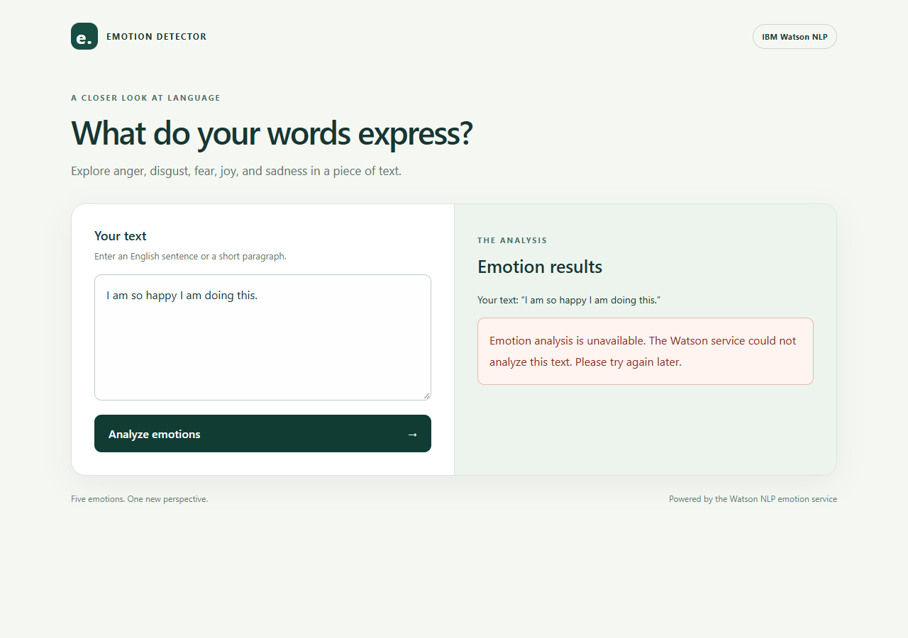
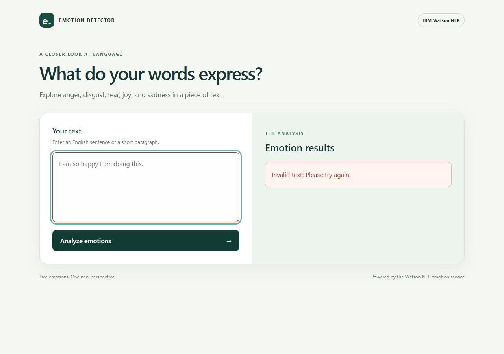

# Emotion Detector: Questions 1-16

Numbering follows the supplied activity/evidence order. No separate question wording was supplied.

Repository: https://github.com/ashmitpro-design/oaqjp-final-project-emb-ai

**Live-service limitation:** Watson could not be reached (ConnectTimeout). The five live tests failed; 16 offline tests passed. HTTP fixtures in offline tests are explicitly synthetic. The deployment screenshot shows the genuine unavailable-service message, not a successful prediction.

All code excerpts are the completed implementation captured during verification; no earlier incomplete version is presented as the final source.

## Question 1: README URL

[README.md](https://github.com/ashmitpro-design/oaqjp-final-project-emb-ai/blob/main/README.md)

https://github.com/ashmitpro-design/oaqjp-final-project-emb-ai/blob/main/README.md

## Question 2: Emotion detection application code

[evidence/2a_emotion_detection.txt](https://github.com/ashmitpro-design/oaqjp-final-project-emb-ai/blob/main/evidence/2a_emotion_detection.txt)

```python
"""Analyze text with the IBM Skills Network Watson NLP REST service."""

import logging
import math
import os

import requests

EMOTIONS = ("anger", "disgust", "fear", "joy", "sadness")
DEFAULT_URL = (
    "https://sn-watson-emotion.labs.skills.network/"
    "v1/watson.runtime.nlp.v1/NlpService/EmotionPredict"
)
MODEL_ID = "emotion_aggregated-workflow_lang_en_stock"
LOGGER = logging.getLogger(__name__)


def unavailable_result():
    """Return the assignment's six-key unavailable response."""
    return dict.fromkeys((*EMOTIONS, "dominant_emotion"))


def emotion_detector(text_to_analyze):
    """Return five emotion scores and their maximum, or six None values.

    HTTP 400, other unsuccessful statuses, connection failures, and malformed
    responses return the same unavailable structure. Blank input never makes
    a network request. Ties use the first emotion in EMOTIONS order.
    """
    if not isinstance(text_to_analyze, str) or not text_to_analyze.strip():
        return unavailable_result()

    try:
        response = requests.post(
            os.environ.get("WATSON_EMOTION_URL", DEFAULT_URL),
            json={"raw_document": {"text": text_to_analyze}},
            headers={"grpc-metadata-mm-model-id": MODEL_ID},
            timeout=(5, 20),
        )
        if response.status_code == 400:
            return unavailable_result()
        if response.status_code != 200:
            LOGGER.warning("Watson emotion service returned HTTP %s", response.status_code)
            return unavailable_result()

        emotions = response.json()["emotionPredictions"][0]["emotion"]
        scores = {name: emotions[name] for name in EMOTIONS}
        if any(
            isinstance(value, bool)
            or not isinstance(value, (int, float))
            or not math.isfinite(value)
            or not 0 <= value <= 1
            for value in scores.values()
        ):
            return unavailable_result()
    except (requests.RequestException, ValueError, KeyError, IndexError, TypeError):
        # Do not log input text, headers, credentials, or arbitrary response bodies.
        LOGGER.warning("Watson emotion service is unavailable or returned invalid data")
        return unavailable_result()

    return {**scores, "dominant_emotion": max(scores, key=scores.get)}
```

## Question 3: Application import and real execution

[evidence/2b_application_creation.txt](https://github.com/ashmitpro-design/oaqjp-final-project-emb-ai/blob/main/evidence/2b_application_creation.txt)

```text
$ python -c from EmotionDetection.emotion_detection import emotion_detector; print('Application module import: PASS'); print('Live call: I am so happy I am doing this.'); print(emotion_detector('I am so happy I am doing this.'))
Application module import: PASS
Live call: I am so happy I am doing this.
{'anger': None, 'disgust': None, 'fear': None, 'joy': None, 'sadness': None, 'dominant_emotion': None}
Watson emotion service is unavailable or returned invalid data

Exit code: 0
```

## Question 4: Formatted emotion detection code

[evidence/3a_output_formatting.txt](https://github.com/ashmitpro-design/oaqjp-final-project-emb-ai/blob/main/evidence/3a_output_formatting.txt)

```python
"""Analyze text with the IBM Skills Network Watson NLP REST service."""

import logging
import math
import os

import requests

EMOTIONS = ("anger", "disgust", "fear", "joy", "sadness")
DEFAULT_URL = (
    "https://sn-watson-emotion.labs.skills.network/"
    "v1/watson.runtime.nlp.v1/NlpService/EmotionPredict"
)
MODEL_ID = "emotion_aggregated-workflow_lang_en_stock"
LOGGER = logging.getLogger(__name__)


def unavailable_result():
    """Return the assignment's six-key unavailable response."""
    return dict.fromkeys((*EMOTIONS, "dominant_emotion"))


def emotion_detector(text_to_analyze):
    """Return five emotion scores and their maximum, or six None values.

    HTTP 400, other unsuccessful statuses, connection failures, and malformed
    responses return the same unavailable structure. Blank input never makes
    a network request. Ties use the first emotion in EMOTIONS order.
    """
    if not isinstance(text_to_analyze, str) or not text_to_analyze.strip():
        return unavailable_result()

    try:
        response = requests.post(
            os.environ.get("WATSON_EMOTION_URL", DEFAULT_URL),
            json={"raw_document": {"text": text_to_analyze}},
            headers={"grpc-metadata-mm-model-id": MODEL_ID},
            timeout=(5, 20),
        )
        if response.status_code == 400:
            return unavailable_result()
        if response.status_code != 200:
            LOGGER.warning("Watson emotion service returned HTTP %s", response.status_code)
            return unavailable_result()

        emotions = response.json()["emotionPredictions"][0]["emotion"]
        scores = {name: emotions[name] for name in EMOTIONS}
        if any(
            isinstance(value, bool)
            or not isinstance(value, (int, float))
            or not math.isfinite(value)
            or not 0 <= value <= 1
            for value in scores.values()
        ):
            return unavailable_result()
    except (requests.RequestException, ValueError, KeyError, IndexError, TypeError):
        # Do not log input text, headers, credentials, or arbitrary response bodies.
        LOGGER.warning("Watson emotion service is unavailable or returned invalid data")
        return unavailable_result()

    return {**scores, "dominant_emotion": max(scores, key=scores.get)}
```

## Question 5: Actual formatted output

[evidence/3b_formatted_output_test.txt](https://github.com/ashmitpro-design/oaqjp-final-project-emb-ai/blob/main/evidence/3b_formatted_output_test.txt)

```text
$ python -c from EmotionDetection.emotion_detection import emotion_detector; print('Application module import: PASS'); print('Live call: I am so happy I am doing this.'); print(emotion_detector('I am so happy I am doing this.'))
Application module import: PASS
Live call: I am so happy I am doing this.
{'anger': None, 'disgust': None, 'fear': None, 'joy': None, 'sadness': None, 'dominant_emotion': None}
Watson emotion service is unavailable or returned invalid data

Exit code: 0
```

## Question 6: Package __init__.py URL

[EmotionDetection/__init__.py](https://github.com/ashmitpro-design/oaqjp-final-project-emb-ai/blob/main/EmotionDetection/__init__.py)

https://github.com/ashmitpro-design/oaqjp-final-project-emb-ai/blob/main/EmotionDetection/__init__.py

## Question 7: Package validation output

[evidence/4b_packaging_test.txt](https://github.com/ashmitpro-design/oaqjp-final-project-emb-ai/blob/main/evidence/4b_packaging_test.txt)

```text
$ python -c from EmotionDetection import emotion_detector; import EmotionDetection.emotion_detection; print('Package and module imports: PASS'); print('Blank input:', emotion_detector(''))
Package and module imports: PASS
Blank input: {'anger': None, 'disgust': None, 'fear': None, 'joy': None, 'sadness': None, 'dominant_emotion': None}

Exit code: 0
```

## Question 8: Complete unit test code

[evidence/5a_unit_testing.txt](https://github.com/ashmitpro-design/oaqjp-final-project-emb-ai/blob/main/evidence/5a_unit_testing.txt)

```python
"""Offline contract tests plus opt-in, unmocked Watson integration tests.

Synthetic scores below are test fixtures, never captured Watson responses.
Set RUN_WATSON_LIVE_TESTS=1 to test the five sentences against the real model.
"""

import os
import unittest
from unittest.mock import Mock, patch

import requests

from EmotionDetection import emotion_detector
from EmotionDetection.emotion_detection import DEFAULT_URL, EMOTIONS, MODEL_ID
from server import app

SAMPLES = (
    ("I am glad this happened", "joy"),
    ("I am really mad about this", "anger"),
    ("I feel disgusted just hearing about this", "disgust"),
    ("I am so sad about this", "sadness"),
    ("I am really afraid that this will happen", "fear"),
)
UNAVAILABLE = dict.fromkeys((*EMOTIONS, "dominant_emotion"))


def synthetic_response(dominant):
    """Build explicitly synthetic HTTP fixtures to test parsing and selection."""
    scores = {name: 0.02 for name in EMOTIONS}
    scores[dominant] = 0.9
    return Mock(status_code=200, json=Mock(return_value={
        "emotionPredictions": [{"emotion": scores, "target": ""}]
    }))


class EmotionDetectorTests(unittest.TestCase):
    """Test the HTTP contract and failure behavior independently of Watson."""

    def check_sample(self, index):
        """Verify exact request and all returned scores for a synthetic fixture."""
        text, dominant = SAMPLES[index]
        response = synthetic_response(dominant)
        with patch.dict(os.environ, {"WATSON_EMOTION_URL": DEFAULT_URL}):
            with patch("EmotionDetection.emotion_detection.requests.post",
                       return_value=response) as post:
                result = emotion_detector(text)
        post.assert_called_once_with(
            DEFAULT_URL, json={"raw_document": {"text": text}},
            headers={"grpc-metadata-mm-model-id": MODEL_ID}, timeout=(5, 20),
        )
        expected = response.json()["emotionPredictions"][0]["emotion"]
        self.assertEqual(result, {**expected, "dominant_emotion": dominant})

    def test_joy_sample_with_mocked_service(self):
        self.check_sample(0)

    def test_anger_sample_with_mocked_service(self):
        self.check_sample(1)

    def test_disgust_sample_with_mocked_service(self):
        self.check_sample(2)

    def test_sadness_sample_with_mocked_service(self):
        self.check_sample(3)

    def test_fear_sample_with_mocked_service(self):
        self.check_sample(4)

    @patch("EmotionDetection.emotion_detection.requests.post")
    def test_blank_and_non_string_input_never_call_service(self, post):
        for text in ("", " \n\t", None, 42):
            with self.subTest(text=text):
                self.assertEqual(emotion_detector(text), UNAVAILABLE)
        post.assert_not_called()

    @patch("EmotionDetection.emotion_detection.requests.post")
    def test_http_400_returns_all_none_without_parsing_body(self, post):
        post.return_value.status_code = 400
        self.assertEqual(emotion_detector("rejected input"), UNAVAILABLE)
        post.return_value.json.assert_not_called()

    @patch("EmotionDetection.emotion_detection.requests.post")
    def test_unsuccessful_statuses(self, post):
        for status in (401, 403, 429, 500, 503):
            with self.subTest(status=status):
                post.return_value.status_code = status
                self.assertEqual(emotion_detector("Hello"), UNAVAILABLE)

    @patch("EmotionDetection.emotion_detection.requests.post")
    def test_network_failures(self, post):
        for error in (requests.Timeout(), requests.ConnectionError()):
            with self.subTest(error=type(error).__name__):
                post.side_effect = error
                self.assertEqual(emotion_detector("Hello"), UNAVAILABLE)

    @patch("EmotionDetection.emotion_detection.requests.post")
    def test_malformed_response(self, post):
        post.return_value.status_code = 200
        for payload in ({}, {"emotionPredictions": []},
                        {"emotionPredictions": [{"emotion": {}}]}, None):
            with self.subTest(payload=payload):
                post.return_value.json.return_value = payload
                self.assertEqual(emotion_detector("Hello"), UNAVAILABLE)
        post.return_value.json.side_effect = ValueError("not JSON")
        self.assertEqual(emotion_detector("Hello"), UNAVAILABLE)

    @patch("EmotionDetection.emotion_detection.requests.post")
    def test_invalid_scores(self, post):
        for value in (None, "0.9", True, -0.1, 1.1, float("nan"), float("inf")):
            with self.subTest(value=value):
                response = synthetic_response("joy")
                response.json.return_value["emotionPredictions"][0]["emotion"]["joy"] = value
                post.return_value = response
                self.assertEqual(emotion_detector("Hello"), UNAVAILABLE)

    @patch("EmotionDetection.emotion_detection.requests.post")
    def test_tie_has_deterministic_result(self, post):
        post.return_value = Mock(status_code=200, json=Mock(return_value={
            "emotionPredictions": [{"emotion": dict.fromkeys(EMOTIONS, 0.2)}]
        }))
        self.assertEqual(emotion_detector("Hello")["dominant_emotion"], "anger")


class FlaskTests(unittest.TestCase):
    """Verify routes, rendered assets, and validation before service calls."""

    def setUp(self):
        app.config.update(TESTING=True)
        self.client = app.test_client()

    def test_home_and_assets(self):
        response = self.client.get("/")
        self.assertEqual(response.status_code, 200)
        self.assertIn(b"Emotion Detector", response.data)
        for asset in ("style.css", "mywebscript.js"):
            with self.client.get(f"/static/{asset}") as asset_response:
                self.assertEqual(asset_response.status_code, 200)

    @patch("server.emotion_detector")
    def test_blank_input_does_not_call_detector(self, detector):
        for query in ({}, {"textToAnalyze": ""}, {"textToAnalyze": " \t\n"}):
            response = self.client.get("/emotionDetector", query_string=query)
            self.assertEqual(response.status_code, 400)
            self.assertEqual(response.text, "Invalid text! Please try again.")
        detector.assert_not_called()

    @patch("server.emotion_detector")
    def test_formatted_success_with_mocked_detector(self, detector):
        detector.return_value = {
            "anger": 0.1, "disgust": 0.2, "fear": 0.3,
            "joy": 0.9, "sadness": 0.4, "dominant_emotion": "joy",
        }
        response = self.client.get("/emotionDetector", query_string={
            "textToAnalyze": "I love this & that + everything!"
        })
        self.assertEqual(response.status_code, 200)
        self.assertEqual(response.mimetype, "text/plain")
        self.assertEqual(response.text,
                         "For the given statement, the system response is 'anger': 0.1, "
                         "'disgust': 0.2, 'fear': 0.3, 'joy': 0.9 and 'sadness': 0.4. "
                         "The dominant emotion is joy.")
        detector.assert_called_once_with("I love this & that + everything!")

    @patch("server.emotion_detector", return_value=UNAVAILABLE)
    def test_service_unavailable_has_clear_message(self, detector):
        response = self.client.get("/emotionDetector?textToAnalyze=Hello")
        self.assertEqual(response.status_code, 503)
        self.assertIn("Emotion analysis is unavailable", response.text)
        detector.assert_called_once_with("Hello")


@unittest.skipUnless(os.environ.get("RUN_WATSON_LIVE_TESTS") == "1",
                     "Requires live Watson service; set RUN_WATSON_LIVE_TESTS=1")
class WatsonLiveTests(unittest.TestCase):
    """These tests use real HTTP calls; unavailable service is a failure."""

    def check_live_sample(self, index):
        text, expected = SAMPLES[index]
        result = emotion_detector(text)
        self.assertIsNotNone(result["dominant_emotion"], "Watson service unavailable")
        self.assertEqual(result["dominant_emotion"], expected)

    def test_live_joy(self):
        self.check_live_sample(0)

    def test_live_anger(self):
        self.check_live_sample(1)

    def test_live_disgust(self):
        self.check_live_sample(2)

    def test_live_sadness(self):
        self.check_live_sample(3)

    def test_live_fear(self):
        self.check_live_sample(4)


if __name__ == "__main__":
    unittest.main(verbosity=2)
```

## Question 9: Actual unit test results

[evidence/5b_unit_testing_result.txt](https://github.com/ashmitpro-design/oaqjp-final-project-emb-ai/blob/main/evidence/5b_unit_testing_result.txt)

```text
$ python -m unittest -v test_emotion_detection
test_anger_sample_with_mocked_service (test_emotion_detection.EmotionDetectorTests.test_anger_sample_with_mocked_service) ... ok
test_blank_and_non_string_input_never_call_service (test_emotion_detection.EmotionDetectorTests.test_blank_and_non_string_input_never_call_service) ... ok
test_disgust_sample_with_mocked_service (test_emotion_detection.EmotionDetectorTests.test_disgust_sample_with_mocked_service) ... ok
test_fear_sample_with_mocked_service (test_emotion_detection.EmotionDetectorTests.test_fear_sample_with_mocked_service) ... ok
test_http_400_returns_all_none_without_parsing_body (test_emotion_detection.EmotionDetectorTests.test_http_400_returns_all_none_without_parsing_body) ... ok
test_invalid_scores (test_emotion_detection.EmotionDetectorTests.test_invalid_scores) ... ok
test_joy_sample_with_mocked_service (test_emotion_detection.EmotionDetectorTests.test_joy_sample_with_mocked_service) ... ok
test_malformed_response (test_emotion_detection.EmotionDetectorTests.test_malformed_response) ... Watson emotion service is unavailable or returned invalid data
Watson emotion service is unavailable or returned invalid data
Watson emotion service is unavailable or returned invalid data
Watson emotion service is unavailable or returned invalid data
Watson emotion service is unavailable or returned invalid data
ok
test_network_failures (test_emotion_detection.EmotionDetectorTests.test_network_failures) ... Watson emotion service is unavailable or returned invalid data
Watson emotion service is unavailable or returned invalid data
ok
test_sadness_sample_with_mocked_service (test_emotion_detection.EmotionDetectorTests.test_sadness_sample_with_mocked_service) ... ok
test_tie_has_deterministic_result (test_emotion_detection.EmotionDetectorTests.test_tie_has_deterministic_result) ... ok
test_unsuccessful_statuses (test_emotion_detection.EmotionDetectorTests.test_unsuccessful_statuses) ... Watson emotion service returned HTTP 401
Watson emotion service returned HTTP 403
Watson emotion service returned HTTP 429
Watson emotion service returned HTTP 500
Watson emotion service returned HTTP 503
ok
test_blank_input_does_not_call_detector (test_emotion_detection.FlaskTests.test_blank_input_does_not_call_detector) ... ok
test_formatted_success_with_mocked_detector (test_emotion_detection.FlaskTests.test_formatted_success_with_mocked_detector) ... ok
test_home_and_assets (test_emotion_detection.FlaskTests.test_home_and_assets) ... ok
test_service_unavailable_has_clear_message (test_emotion_detection.FlaskTests.test_service_unavailable_has_clear_message) ... ok
test_live_anger (test_emotion_detection.WatsonLiveTests.test_live_anger) ... skipped 'Requires live Watson service; set RUN_WATSON_LIVE_TESTS=1'
test_live_disgust (test_emotion_detection.WatsonLiveTests.test_live_disgust) ... skipped 'Requires live Watson service; set RUN_WATSON_LIVE_TESTS=1'
test_live_fear (test_emotion_detection.WatsonLiveTests.test_live_fear) ... skipped 'Requires live Watson service; set RUN_WATSON_LIVE_TESTS=1'
test_live_joy (test_emotion_detection.WatsonLiveTests.test_live_joy) ... skipped 'Requires live Watson service; set RUN_WATSON_LIVE_TESTS=1'
test_live_sadness (test_emotion_detection.WatsonLiveTests.test_live_sadness) ... skipped 'Requires live Watson service; set RUN_WATSON_LIVE_TESTS=1'

----------------------------------------------------------------------
Ran 21 tests in 0.068s

OK (skipped=5)

Exit code: 0
```

## Question 10: Complete Flask server code

[evidence/6a_server.txt](https://github.com/ashmitpro-design/oaqjp-final-project-emb-ai/blob/main/evidence/6a_server.txt)

```python
"""Serve the Emotion Detector interface and the course's analysis route."""

from flask import Flask, Response, render_template, request

from EmotionDetection import emotion_detector

app = Flask(__name__)
INVALID_TEXT = "Invalid text! Please try again."


@app.get("/")
def index():
    """Render the accessible text-analysis interface."""
    return render_template("index.html")


@app.get("/emotionDetector")
def detect_emotion():
    """Validate input and return the assignment's readable emotion summary."""
    text_to_analyze = request.args.get("textToAnalyze", "")
    if not text_to_analyze.strip():
        return Response(INVALID_TEXT, status=400, mimetype="text/plain")

    result = emotion_detector(text_to_analyze)
    if result["dominant_emotion"] is None:
        message = (
            "Emotion analysis is unavailable. The Watson service could not "
            "analyze this text. Please try again later."
        )
        return Response(message, status=503, mimetype="text/plain")

    message = (
        f"For the given statement, the system response is 'anger': {result['anger']}, "
        f"'disgust': {result['disgust']}, 'fear': {result['fear']}, "
        f"'joy': {result['joy']} and 'sadness': {result['sadness']}. "
        f"The dominant emotion is {result['dominant_emotion']}."
    )
    return Response(message, mimetype="text/plain")


if __name__ == "__main__":
    app.run(host="127.0.0.1", port=5000, debug=False)
```

## Question 11: Deployment screenshot

[evidence/6b_deployment_test.png](https://github.com/ashmitpro-design/oaqjp-final-project-emb-ai/blob/main/evidence/6b_deployment_test.png)



This is real Flask deployment evidence; live emotion inference remains blocked.

## Question 12: HTTP 400 handling code

[evidence/7a_error_handling_function.txt](https://github.com/ashmitpro-design/oaqjp-final-project-emb-ai/blob/main/evidence/7a_error_handling_function.txt)

```python
"""Analyze text with the IBM Skills Network Watson NLP REST service."""

import logging
import math
import os

import requests

EMOTIONS = ("anger", "disgust", "fear", "joy", "sadness")
DEFAULT_URL = (
    "https://sn-watson-emotion.labs.skills.network/"
    "v1/watson.runtime.nlp.v1/NlpService/EmotionPredict"
)
MODEL_ID = "emotion_aggregated-workflow_lang_en_stock"
LOGGER = logging.getLogger(__name__)


def unavailable_result():
    """Return the assignment's six-key unavailable response."""
    return dict.fromkeys((*EMOTIONS, "dominant_emotion"))


def emotion_detector(text_to_analyze):
    """Return five emotion scores and their maximum, or six None values.

    HTTP 400, other unsuccessful statuses, connection failures, and malformed
    responses return the same unavailable structure. Blank input never makes
    a network request. Ties use the first emotion in EMOTIONS order.
    """
    if not isinstance(text_to_analyze, str) or not text_to_analyze.strip():
        return unavailable_result()

    try:
        response = requests.post(
            os.environ.get("WATSON_EMOTION_URL", DEFAULT_URL),
            json={"raw_document": {"text": text_to_analyze}},
            headers={"grpc-metadata-mm-model-id": MODEL_ID},
            timeout=(5, 20),
        )
        if response.status_code == 400:
            return unavailable_result()
        if response.status_code != 200:
            LOGGER.warning("Watson emotion service returned HTTP %s", response.status_code)
            return unavailable_result()

        emotions = response.json()["emotionPredictions"][0]["emotion"]
        scores = {name: emotions[name] for name in EMOTIONS}
        if any(
            isinstance(value, bool)
            or not isinstance(value, (int, float))
            or not math.isfinite(value)
            or not 0 <= value <= 1
            for value in scores.values()
        ):
            return unavailable_result()
    except (requests.RequestException, ValueError, KeyError, IndexError, TypeError):
        # Do not log input text, headers, credentials, or arbitrary response bodies.
        LOGGER.warning("Watson emotion service is unavailable or returned invalid data")
        return unavailable_result()

    return {**scores, "dominant_emotion": max(scores, key=scores.get)}
```

## Question 13: Flask blank-input handling code

[evidence/7b_error_handling_server.txt](https://github.com/ashmitpro-design/oaqjp-final-project-emb-ai/blob/main/evidence/7b_error_handling_server.txt)

```python
"""Serve the Emotion Detector interface and the course's analysis route."""

from flask import Flask, Response, render_template, request

from EmotionDetection import emotion_detector

app = Flask(__name__)
INVALID_TEXT = "Invalid text! Please try again."


@app.get("/")
def index():
    """Render the accessible text-analysis interface."""
    return render_template("index.html")


@app.get("/emotionDetector")
def detect_emotion():
    """Validate input and return the assignment's readable emotion summary."""
    text_to_analyze = request.args.get("textToAnalyze", "")
    if not text_to_analyze.strip():
        return Response(INVALID_TEXT, status=400, mimetype="text/plain")

    result = emotion_detector(text_to_analyze)
    if result["dominant_emotion"] is None:
        message = (
            "Emotion analysis is unavailable. The Watson service could not "
            "analyze this text. Please try again later."
        )
        return Response(message, status=503, mimetype="text/plain")

    message = (
        f"For the given statement, the system response is 'anger': {result['anger']}, "
        f"'disgust': {result['disgust']}, 'fear': {result['fear']}, "
        f"'joy': {result['joy']} and 'sadness': {result['sadness']}. "
        f"The dominant emotion is {result['dominant_emotion']}."
    )
    return Response(message, mimetype="text/plain")


if __name__ == "__main__":
    app.run(host="127.0.0.1", port=5000, debug=False)
```

## Question 14: Blank-input screenshot

[evidence/7c_error_handling_interface.png](https://github.com/ashmitpro-design/oaqjp-final-project-emb-ai/blob/main/evidence/7c_error_handling_interface.png)



## Question 15: Final server code for static analysis

[evidence/8a_server_modified.txt](https://github.com/ashmitpro-design/oaqjp-final-project-emb-ai/blob/main/evidence/8a_server_modified.txt)

```python
"""Serve the Emotion Detector interface and the course's analysis route."""

from flask import Flask, Response, render_template, request

from EmotionDetection import emotion_detector

app = Flask(__name__)
INVALID_TEXT = "Invalid text! Please try again."


@app.get("/")
def index():
    """Render the accessible text-analysis interface."""
    return render_template("index.html")


@app.get("/emotionDetector")
def detect_emotion():
    """Validate input and return the assignment's readable emotion summary."""
    text_to_analyze = request.args.get("textToAnalyze", "")
    if not text_to_analyze.strip():
        return Response(INVALID_TEXT, status=400, mimetype="text/plain")

    result = emotion_detector(text_to_analyze)
    if result["dominant_emotion"] is None:
        message = (
            "Emotion analysis is unavailable. The Watson service could not "
            "analyze this text. Please try again later."
        )
        return Response(message, status=503, mimetype="text/plain")

    message = (
        f"For the given statement, the system response is 'anger': {result['anger']}, "
        f"'disgust': {result['disgust']}, 'fear': {result['fear']}, "
        f"'joy': {result['joy']} and 'sadness': {result['sadness']}. "
        f"The dominant emotion is {result['dominant_emotion']}."
    )
    return Response(message, mimetype="text/plain")


if __name__ == "__main__":
    app.run(host="127.0.0.1", port=5000, debug=False)
```

## Question 16: Actual Pylint command and result

[evidence/8b_static_code_analysis.txt](https://github.com/ashmitpro-design/oaqjp-final-project-emb-ai/blob/main/evidence/8b_static_code_analysis.txt)

```text
$ python -m pylint server.py

--------------------------------------------------------------------
Your code has been rated at 10.00/10 (previous run: 10.00/10, +0.00)


Exit code: 0
```

## Additional live verification

[Actual network probe](https://github.com/ashmitpro-design/oaqjp-final-project-emb-ai/blob/main/evidence/watson_live_probe.txt)
[Five real integration-test failures](https://github.com/ashmitpro-design/oaqjp-final-project-emb-ai/blob/main/evidence/5c_live_unit_testing_result.txt)
[Real browser verification](https://github.com/ashmitpro-design/oaqjp-final-project-emb-ai/blob/main/evidence/6c_browser_verification.txt)

To finish live verification, run the project in your course Skills Network lab or a network with access to the course service. Run the opt-in live tests and recapture the deployment screenshot after receiving a genuine prediction. See README.md for exact commands.
